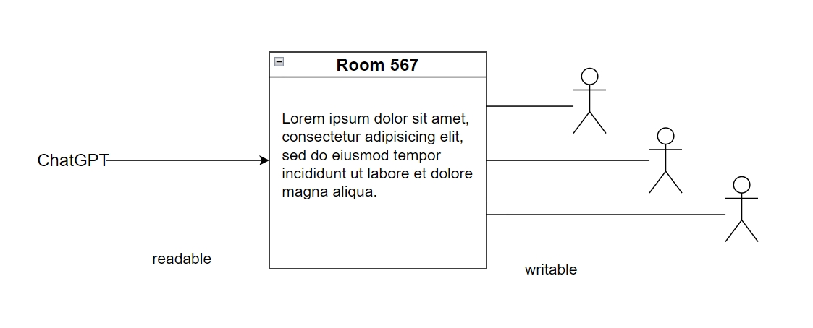

# stream (server - browser)

服务器端生成一个可读流，多个可写流：



多个流的成本太高，要限制使用。

将一个可读流写入多个可写流，可以使用这个库：[Readable Stream Clone](https://www.npmjs.com/package/readable-stream-clone)。这个库很简单，可以直接拷贝源码来使用。


## 后端

Nginx 默认会将响应内容存入缓冲区，然后批量返回给客户端。这会导致流式输出无效，变成常规的执行完毕后一次性输出。因此修改配置，关闭 Nginx 缓存：

    proxy_buffering off;

Nest.js 流式响应的例子，最简单的例子：

```
@Controller('file')
export class FileController {
  @Get()
  getFile(@Res() res: Response) {
    const file = createReadStream(join(process.cwd(), 'package.json'));
    file.pipe(res);
  }
}
```

但上述例子不好的地方是，后端再无法控制流式处理。通常在流式响应结束之后，会加入更多处理，因此需要改进。
改进办法是返回一个 StreamableFile，NestJS 会自动处理 pipe 功能。例子：

```
import { Controller, Get, StreamableFile } from '@nestjs/common';
import { createReadStream } from 'fs';
import { join } from 'path';

@Controller('file')
export class FileController {
  @Get()
  getFile(): StreamableFile {
    const file = createReadStream(join(process.cwd(), 'package.json'));
    return new StreamableFile(file);
  }
}
```

来源：[Streaming files](https://docs.nestjs.com/techniques/streaming-files)


